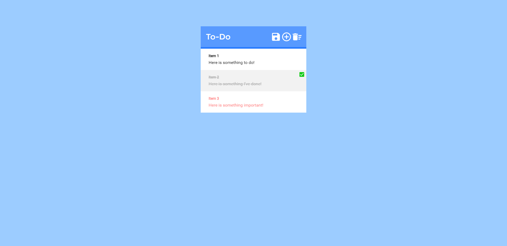

# Orange Jaguars:
### Project One - To-Do List

Our team's submission for the first [Weekly Dev](http://weeklydev.io) project.

__In progress:__

## Guidelines
##### Manage Tasks (required)
- As a user, I can add new tasks to my list so that I know what I have to get done.
- As a user, I can mark tasks on my to do list as completed so that I know what I have accomplished.
- As a user, I can set tasks as highly important, moderately important, or of low importance (default) so that I can know what is the most important.
- As a user, I can delete tasks so that my task list is not filled with irrelevant tasks.
- As a user, I can edit tasks that are created so that I can accurately reflect changes.

    ###### __* These are the only guidlines we're doing SO FAR__

## Technology
#### Front End
- HTML5
- CSS3
- SCSS
- Vanilla JS
- jQuery
- jQuery UI
- Tooltipster

#### Back End
- Python 3.4.4
- MySQL
- Flask
